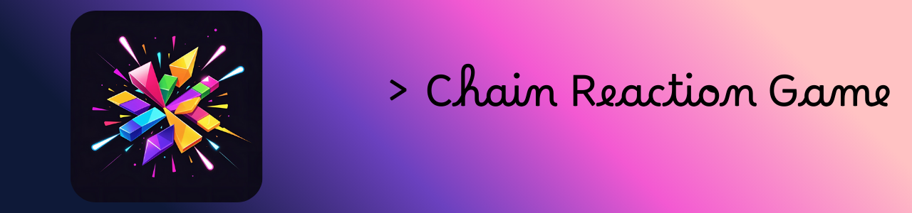
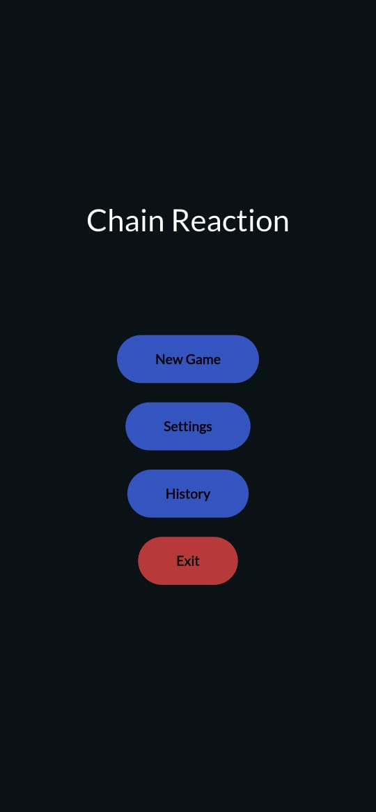
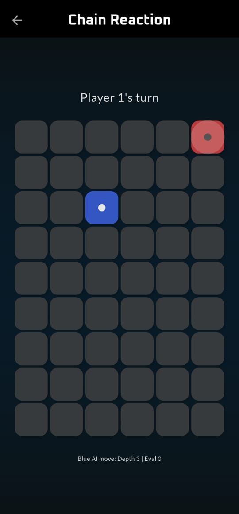
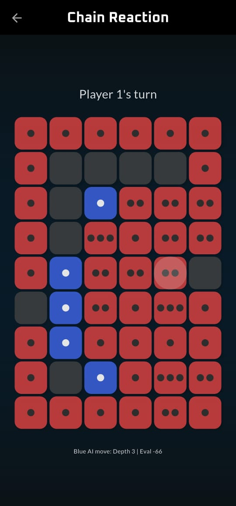
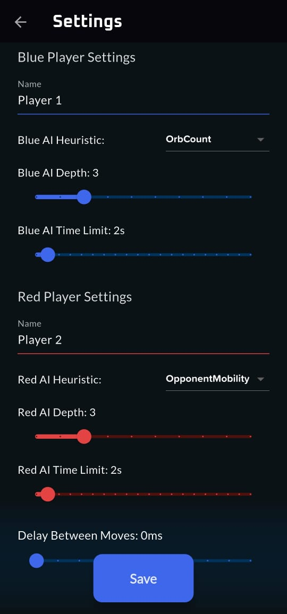
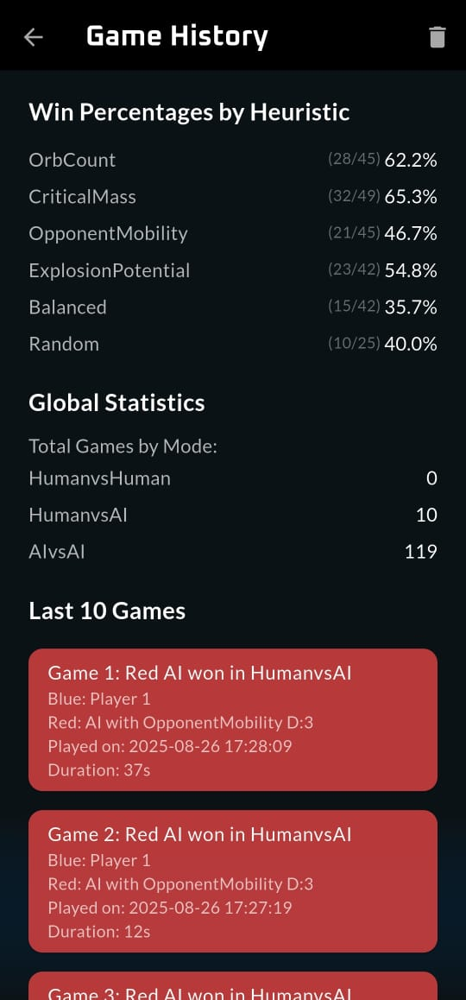

# Chain Reaction Game

Chain Reaction Game is a strategic board game implementation featuring an advanced AI system powered by minimax algorithm with alpha-beta pruning. Built with Flutter, this remake focuses on performance optimization and intelligent gameplay through iterative deepening search and multiple heuristic strategies.

The AI employs alpha-beta pruning to efficiently explore the game tree, reducing the number of nodes evaluated from O(b^d) to approximately O(b^(d/2)) in the best case, where b is the branching factor and d is the search depth. This optimization, combined with iterative deepening, allows the AI to make strategic decisions even in complex board positions with potential chain reactions.

<div align="center">

[](https://flutter.dev)
[](https://dart.dev)
[](https://www.android.com)

</div>

## ✨ Features

- **Multiple Game Modes**
  - Human vs Human
  - Human vs AI
  - AI vs AI

- 🤖 **Advanced AI Implementation**
  - Minimax algorithm with Alpha-Beta pruning
  - Multiple AI difficulty levels
  - Various heuristic evaluation functions:
    - Orb Count Strategy
    - Critical Mass Strategy
    - Opponent Mobility Analysis
    - Explosion Potential Strategy
    - Balanced Strategy
    - Random Strategy

- ⚙️ **Game Configuration**
  - Customizable heuristic strategy for AI
  - AI depth and time limit settings
  - Adjustable move delay for smooth animation

- 📜 **Game History**
  - Track game results
  - View historical performance

## 🛠️ Technical Details

### AI Implementation

The game features a sophisticated AI system that uses:

1. **Minimax Algorithm**
   - Implements alpha-beta pruning for optimization
   - Iterative deepening for better time management
   - Configurable search depth from Settings menu

2. **Heuristic Functions**
   - [OrbCount](lib/algo/chain_reaction_game.dart#L443): Prioritizes maximizing AI's orb count, assuming more orbs indicate a stronger position.
   - [CriticalMass](lib/algo/chain_reaction_game.dart#L466): Encourages moves that bring cells closer to triggering explosions, which can convert opponent orbs.
   - [OpponentMobility](lib/algo/chain_reaction_game.dart#L489): Aims to restrict opponent's options, limiting their strategic flexibility. Works by evaluating the difference in valid moves between AI and opponent.
   - [ExplosionPotential](lib/algo/chain_reaction_game.dart#L509): Promotes chain reactions to capture opponent orbs or expand control. Rewards cells one orb from exploding if adjacent to opponent or empty cells.
   - [Balanced](lib/algo/chain_reaction_game.dart#L428): Combines multiple strategies by linear weighting for optimal play.

### ⚡ Performance Optimizations
#### Efficient board state management
The game uses a string-based cell representation ('0' for empty, 'nB'/'nR' for n orbs) which significantly reduces memory usage compared to using custom objects for each cell. This approach enables quick state comparisons and efficient serialization for file storage. Alternative approaches like using enums or custom cell objects would have increased memory overhead and complicated the serialization process for game state persistence.

Code example from [implementation](lib/algo/chain_reaction_game.dart#L121):
```dart
List<List<String>> board = List.generate(
  GameConfig.rows,
  (_) => List.filled(GameConfig.cols, '0'),
);
```
#### Background computation for AI moves
The implementation uses Dart's compute() function to run the minimax algorithm in a separate isolate, preventing UI freezes during complex calculations. This is crucial because the minimax search can explore thousands of board positions. Without isolates, even a depth-3 search could cause noticeable UI lag, especially during chain reactions.

Key [implementation](lib/algo/chain_reaction_game.dart#L561):
```dart
final GameState bestMove = await compute(runMinimax, args);
```

#### Memory-efficient data structures
The game employs three key data structures that work together for optimal performance:

1. Queue<MapEntry<int, int>> for explosion chains ([implementation](lib/algo/chain_reaction_game.dart#L173)):
   ```dart
   Queue<MapEntry<int, int>> explosionQueue = Queue();
   ```
   Using a queue instead of a list ensures O(1) operations for both adding and removing explosion cells. A regular list would have required O(n) operations for removing elements from the beginning.

2. Set<String> for tracking explosions ([implementation](lib/algo/chain_reaction_game.dart#L174)):
   ```dart
   Set<String> explodedThisPass = {};
   ```
   Using a set provides O(1) lookup for checking already exploded cells, compared to O(n) with a list. This is critical during chain reactions where the same cell might be checked multiple times.

3. List.from() for efficient board copying ([implementation](lib/algo/chain_reaction_game.dart#L171)):
   ```dart
   var tempBoard = board.map((row) => List<String>.from(row)).toList();
   ```
   This approach creates shallow copies where needed, avoiding deep copying of immutable string values. Using a deep copy method would have unnecessarily duplicated the string data for each cell.

These optimizations become especially important during AI calculations where the minimax algorithm needs to simulate thousands of potential moves and explosions.

## 🎲 Game Rules

1. Players take turns placing orbs (🔵|🔴) in cells
2. Each cell has a critical mass which is equal to the number of neighbouring cells. So this may change based on its position:
   - Corner cells: 2
   - Edge cells: 3
   - Middle cells: 4
3. When a cell reaches critical mass, it explodes 💥:
   - Distributes orbs to adjacent cells
   - Converts opponents' orbs into own
4. Game ends when one player owns all orbs on board 🏆

## 🛠️ Building from Source

1. **Prerequisites**
   - Flutter SDK
   - Dart SDK
   - Android Studio / VS Code

2. **Setup**
   ```bash
   # Clone the repository
   git clone https://github.com/RudraShivm/Chain-Reaction-Remake.git
   
   # Navigate to project directory
   cd Chain-Reaction-Remake
   
   # Install dependencies
   flutter pub get
   
   # Run the app
   flutter run
   ```


## 📄 License

This project is licensed under the MIT License - see the [LICENSE](LICENSE) file for details.

## 📸 Screenshots
<div style="display: grid; grid-template-columns: repeat(2, 1fr); gap: 10px;">
    
    
    
    
    
    
</div>


